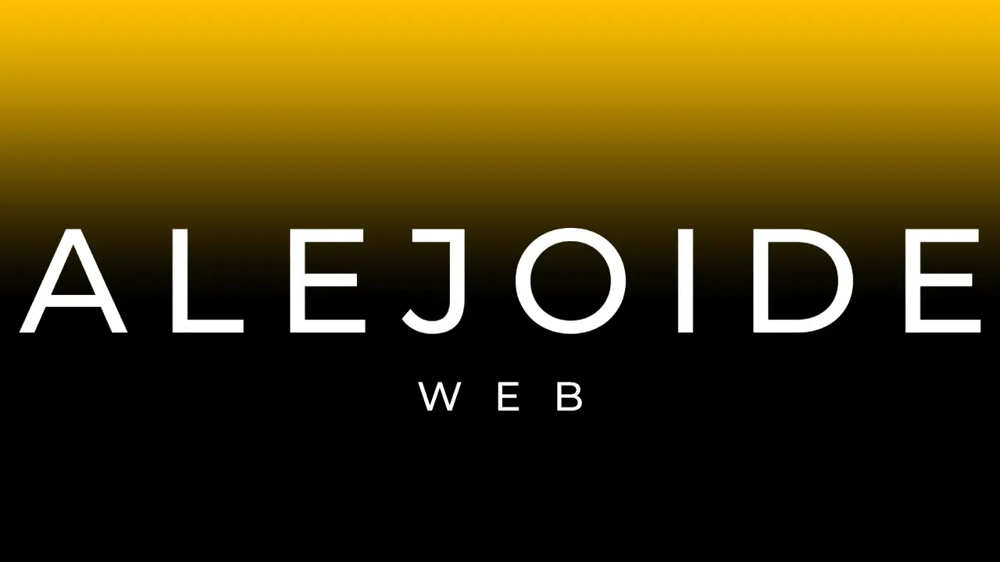
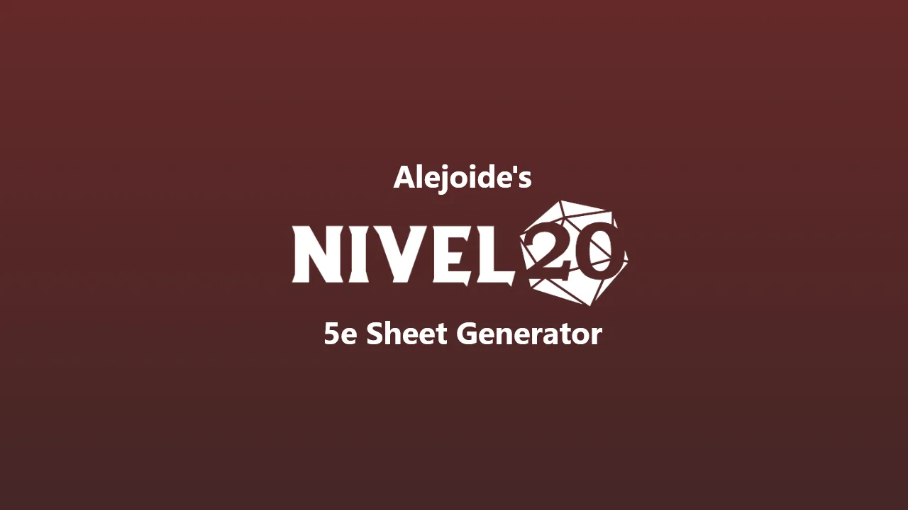
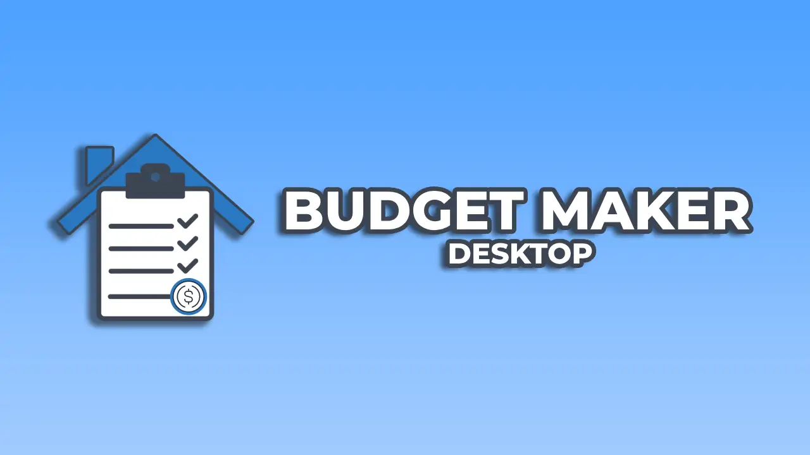
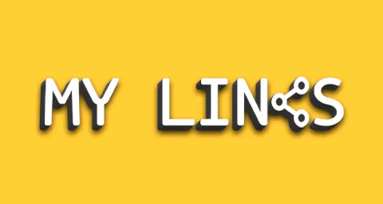

# 👋 ¡Hola! Soy Alejo Sarmiento

## 🚀 Sobre mí

Soy SRE y desarrollador de software con más de 5 años de experiencia en el campo.

Actualmente, me desempeño como SRE / DevOps en la Leafnoise, donde me encargo de la automatización de procesos y la implementación de soluciones relacionadas con la infraestructura y el desarrollo de software.

Podes visitar mi página web personal en [alejoide.com](https://alejoide.com) para conocer más sobre mis proyectos y habilidades.

## 🛠️ Tecnologías que uso

### DevOps

### Lenguajes

### Backend

### Frontend

### Bases de datos

### Desktop

## 📂 Proyectos recientes

    <table>
        <tr>
            <td></td>
            <td></td>
            <td></td>
            <td></td>
            <td></td>
        </tr>
    </table>

## 📫 Redes y contacto

  
